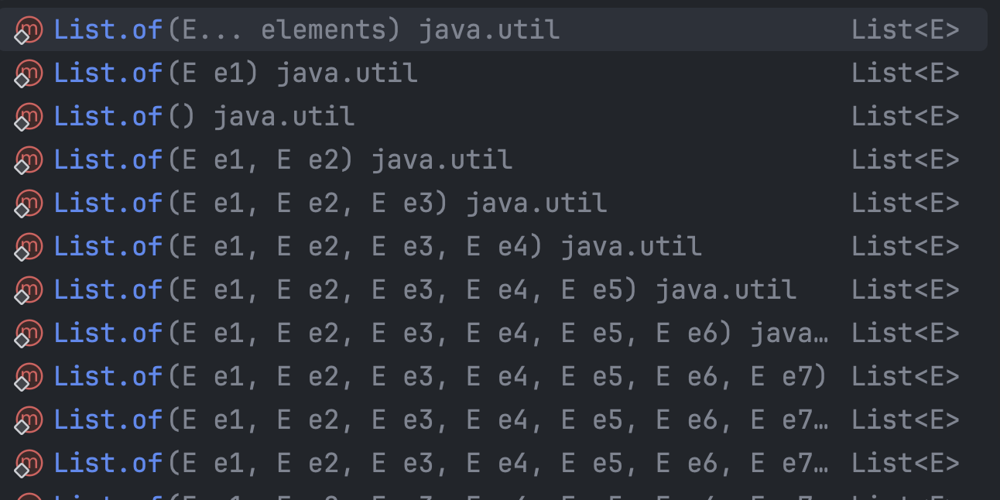

# 가변인수는 신중히 사용하라

## 가변인수란?

```java
int sum(int... args) {
    int sum = 0;

    for (int arg : args) {
        sum += arg;
    }
        
    return sum;
}

sum(1, 2, 3)
```

- 위와 같이 `...`을 통해 인수를 여러개 넘겨주는 것이다.
- 결과적으로 `int[] args`가 넘어오게 된다.
- 사용할 때는 `sum(1, 2, 3)`처럼 비교적 간단하게 사용할 수 있다.
- 가변 인수는 파라미터의 마지막에만 사용할 수 있다.

## 가변인수의 단점

### 최소 필요 개수를 정의하기 어렵다.

- 위 `sum()` 메서드가 최소 2개의 값을 받아야 한다고 생각해보자.
- 그러면 아래와 같이 작성해야 한다.

```java
int sum(int... args) {
    if (args.length < 2) throw new IllegalArgumentException();

    int sum = 0;

    for (int arg : args) {
        sum += arg;
    }
        
    return sum;
}

sum(1) // 런타임 에러
sum(1, 2, 3)
```

- 애초에 런타임 예외이기 때문에 늦게 터져서 별로이다.
- 아래와 같이 작성하는 것이 훨씬 좋은 방법이다.

```java
int sum(int arg1, int arg2, int... args) {
    int sum = arg1 + arg2;

    for (int arg : args) {
        sum += arg;
    }
        
    return sum;
}

sum(1) // 컴파일 에러
sum(1, 2, 3)
```

### 가변인수는 사용될 때마다 배열을 하나 생성하여 할당한다.

- 따라서 속도가 저하될 수 있다.
- 이를 해결하기 위해 `List.of()` 같은 곳에서는 몇개까지 정적으로 작성해놓았다.


