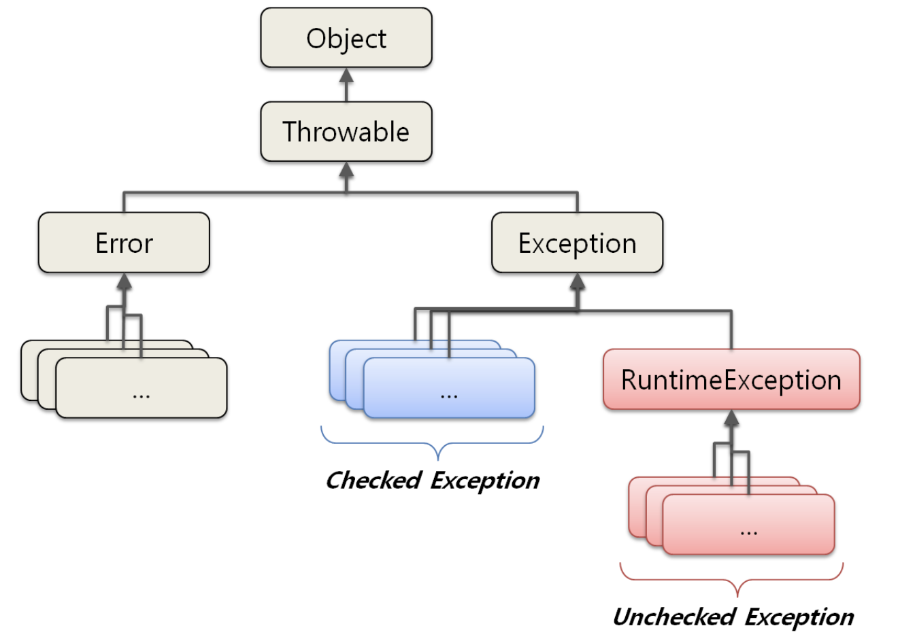

## Checked Exception
- 반드시 처리해야 하는 예외
- 컴파일 단계에서 확인 가능
- RuntimeException 및 하위 클래스를 제외한 나머지 예외
- ex) IOException, CheckedException

```java
public class CheckedExceptionExample {

    public static void main(String[] args) {
        some();
    }

    private static void some() {
        throw new IOException(); // 컴파일 에러
    }
}

```

```java
public class CheckedExceptionExample {

    public static void main(String[] args) {
        try {
            some();
        } catch (IOException e) {
            // ~~~~
        }
    }

    private static void some() throws IOException{
        throw new IOException();
    }
}

```

## Unchecked Exception (Runtime Exception)
- 예외처리를 안 해도 됌
- 런타임 단계에서 확인 가능
- ex) IllegalArgumentException, NullPointException ...

```java
public class UncheckedExceptionExample {

    public static void main(String[] args) {
        some();
    }

    private static void some() {
        throw new IllegalArgumentException();
    }
}

```

### 복구가 가능하다고 믿는다면 검사 예외를, 그렇지 않다면 런타인 예외를 사용하자. 확신하기 어렵다면 비검사 예외를 선택하자

### 프로그래밍 오류를 나타낼 때는 Unchecked Exception 을 사용해야 한다. Unchecked Exception 은 대부분 전제조건을 만족하지 못했을 때 발생한다.


https://mangkyu.tistory.com/152
